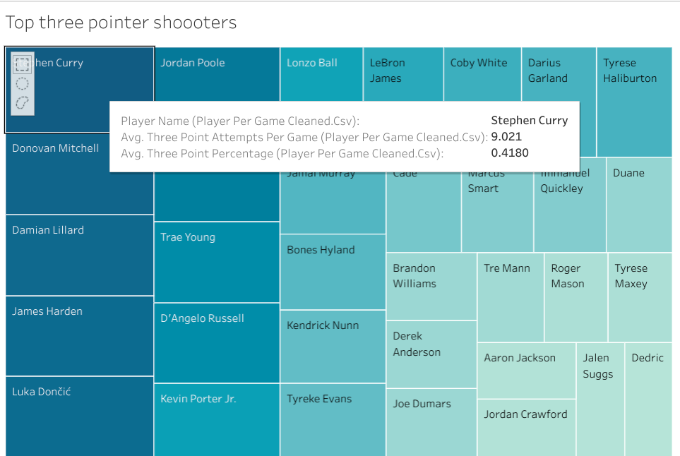
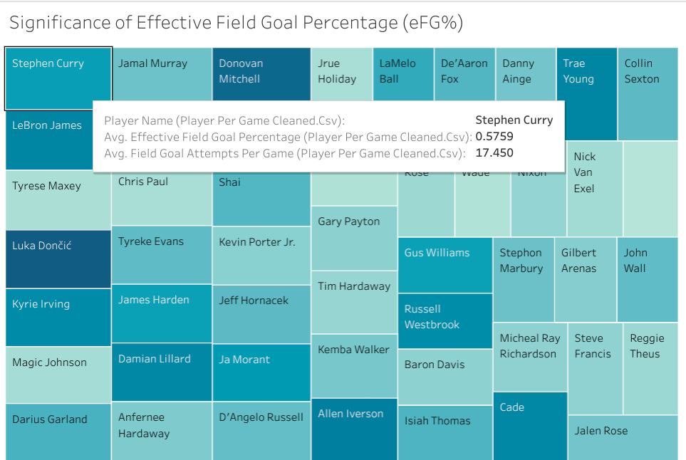
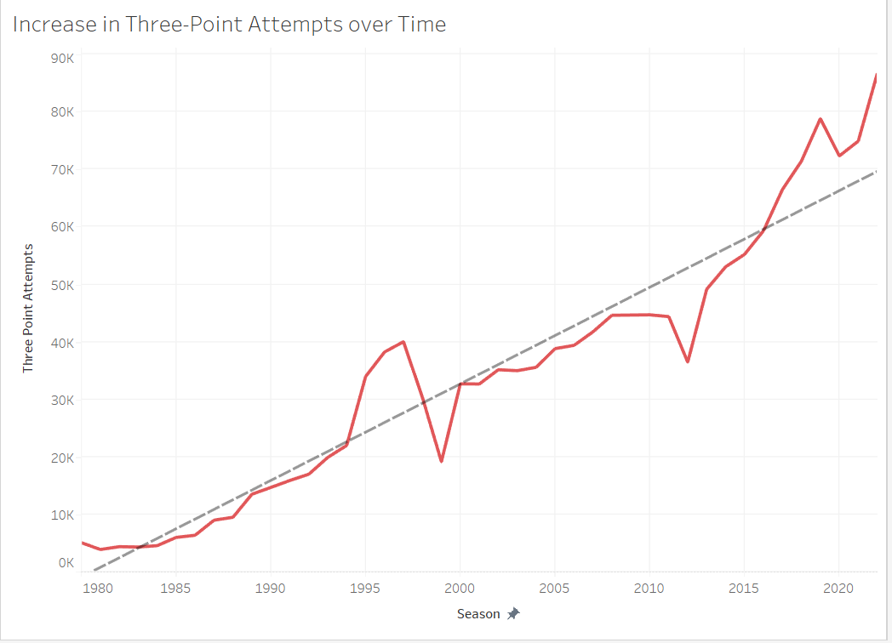
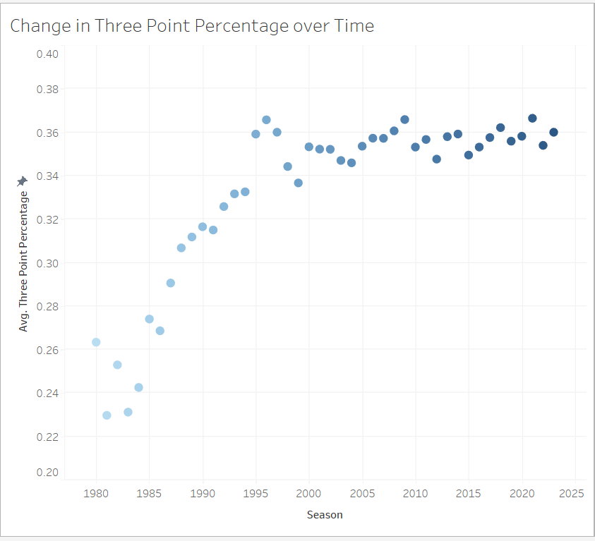
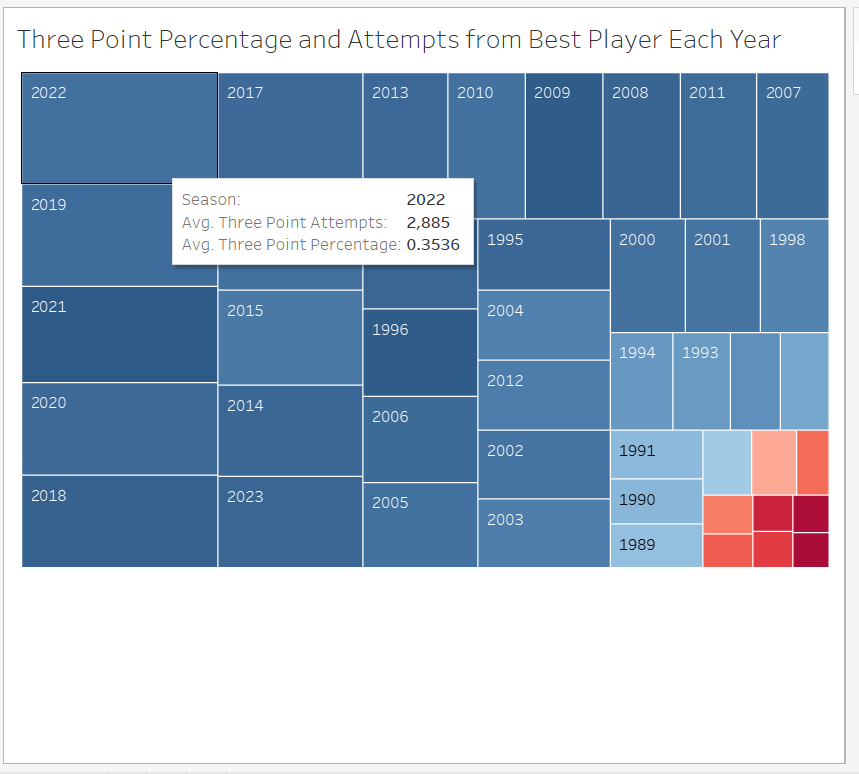
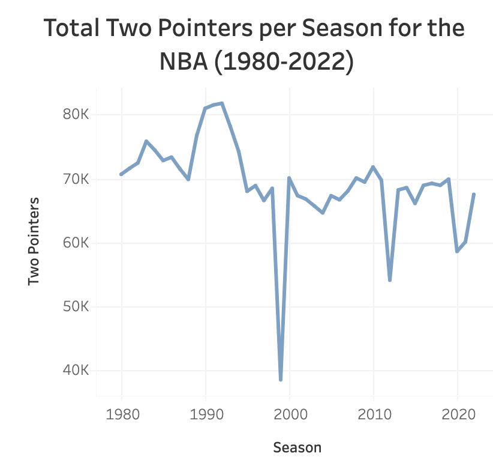
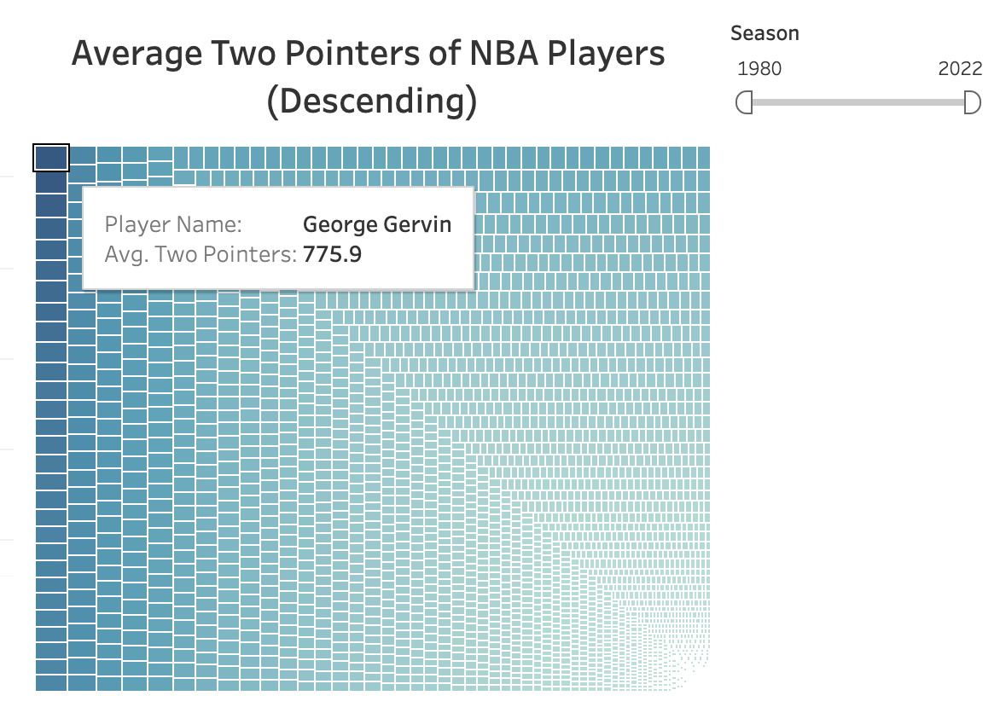
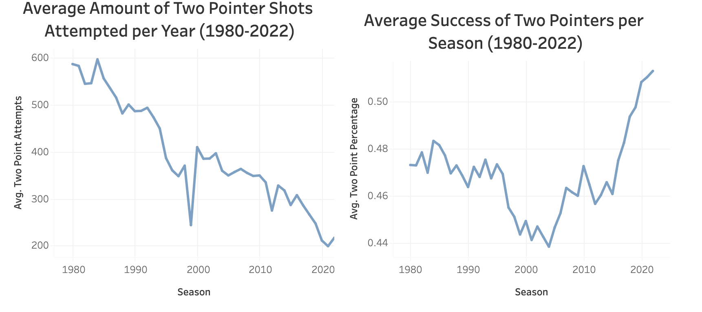

**Introduction**

Through our analytics project, we aim to analyze the impact of Stephen Curry on the game of basketball. Specifically, we want to examine how his playing style has contributed to the rise of three-point shooting and the decline of mid-range shooting in the NBA. By conducting this research, we will quantify Curry’s abilities and skills through data analysis. We also want to show how Curry’s impact on the game has given him a unique place in basketball history.

**Question 1 + Results**

My research goal is to analyze Stephen Curry's offensive skills, particularly his incredible three-point shooting, to show why he is one of the greatest basketball players of all time. In this research, I hope to demonstrate his particular strengths to a larger audience in an understandable manner.

The position of Stephen Curry in the top left corner of the tree map indicates that he has a high number of three-point attempts and an impressive average percentage of successful three-point shots. This suggests that he has exceptional shooting skills and is among the most proficient three-point shooters in basketball history.

Being in the top left corner of the tree map also means that Curry performs better than other players who have similar numbers of field goal attempts and eFG%. This show Stpehen Curry is one of the most efficient and prolific shooters in the NBA, and his performance stands out compared to other players in the league.

The box plot above reveals that Stephen Curry outperforms Ray Allen and Reggie Miller in terms of his scoring ability, as demonstrated by his higher median, wider range, and greater variability in performance.You can find the full analysis [here](https://github.com/ubco-W2022T2-data301/project-group-group-23/blob/main/analysis/analysis1.ipynb) if you are interested in reading a more in depth anaylsis of Stephen Curry ability. 

Overall, Stephen Curry's exceptional three-point shooting abilities and consistent high-ranking performance in various performance metrics establish him as one of the greatest players in basketball history, demonstrating his skill and versatility as a dynamic scorer and shooter among other top players.

**Question 2 + Results**

My research related to the rise of the three-point shot in the NBA. Specifically, my research question was: how much has the three-point volume increased over time in the NBA, and has the three-point percentage increased the same amount? 

This graph shows that three-point attempts in the NBA have increased from around 5,000 in 1980 to over 85,000 in 2022. This increase is drastic, and shows how much the three-point shot has revolutionized the NBA and transformed the way players play the game.

This graph shows that three-point percentage has increased from around 25% in the early 1980s to around 35% today. Although the three-point percentage has stayed at roughly 35% since around the year 2000, players are shooting much higher volumes today, proving that shooters today are better than ever.

This heatmap shows the top three-point shooters from every year of the study based on both attempts and volume. As we can see, the best three-point shooting seasons are all recent, proving that shooters have now become better than ever. You can find the full analysis [here](https://github.com/ubco-W2022T2-data301/project-group-group-23/blob/main/analysis/analysis2.ipynb) if you are interested in learning more about how the three-point shot has changed the game of basketball. 

Overall, this analysis proves that there has been a drastic increase in the number of three-point shots taken in the NBA, with a notable increase in three-point percentage as well. Additonally, since three-point volume has continued increasing, and all the top three-point shooting seasons are recent, the trend towards three-point shooting is likely to continue in the near future.

**Question 3 and Results**
My research investigated the degree that the two-point shots decreased in the NBA. And is mid-range shooting still an effective strategy in the present and future? This study will examine the historical data on mid-range shooting, compare the best mid-range shooters across eras, and explore the current state of mid-range shooting in the NBA to determine its continued relevance as a viable strategy.

This graph shows the total amount of Two Pointers made per season in the NBA has had an uneven decline from 70,685 in 1980. Towards a dramatic decline of 38,158 in 1999 and eventually rose back to 67,517 in 2022. Proving that in 1999 a new generation of players had become specialists in the three pointer shot, but the vast change corrected itself as players seeked alternative strategies

This graph proves that specialization in the Two-pointer shots is a key ability from the generations that rose between 1970-1990 where most of the existing players held a high ability in this. This include George Gervin who has the highest recorded average successful shots, to Michael Jordan being a close secondin terms of the number of Two-point shots but declares him as a champion when including the information on his overall three point scores as seen through the data for question 2.

The following lineplots demonstrate that while the average amount of attempted Two pointer shots between 1980-2022 fell from 587.1 to 216.9, the overall success rate of two pointers increased from 0.47 percent towards 0.51. Proving that the three pointer line has allowed different avenues of specialization on NBA players and evidently removing individuals who brought down the average of success. You can find the full analysis [here](https://github.com/ubco-W2022T2-data301/project-group-group-23/blob/main/analysis/analysis3.ipynb) if you are interested in learning more about how the two point shot has changed. 

In summary while the three pointer shot has overshadowed the two pointer shot since its inception. We see evidence that the two pointer shot will continue to be relevant in the near future. As the individual players become more proficient at the two pointer shot. However George Gervin and Michael Jordan will probably remain undefeated in their overall two pointer success rate as a result of the three pointer being more popular.