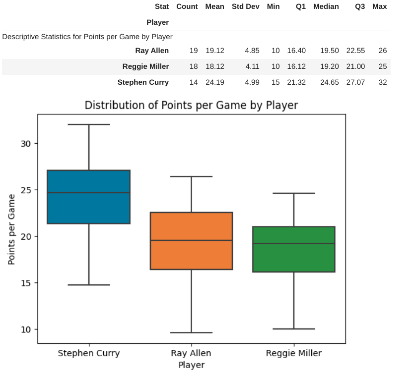

**Introduction**

Through our analytics project, we aim to analyze the impact of Stephen Curry on the game of basketball. Specifically, we want to examine how his playing style has contributed to the rise of three-point shooting and the decline of mid-range shooting in the NBA. By conducting this research, we will quantify Curry’s abilities and skills through data analysis. We also want to show how Curry’s impact on the game has given him a unique place in basketball history.

**Question 1 + Results**

My research goal is to analyze Stephen Curry's offensive skills, particularly his incredible three-point shooting, to show why he is one of the greatest basketball players ever. In addition, in this research, I want to demonstrate his particular strengths to a larger audience in an understandable manner.

The position of Stephen Curry in the top left corner of the tree map indicates that he has a high number of three-point attempts and an impressive average percentage of successful three-point shots. This data suggests he has exceptional shooting skills and is among basketball's most proficient three-point shooters.

Being in the top left corner of the tree map also means that Curry performs better than other players who have similar numbers of field goal attempts and eFG%. This graph shows Stephen Curry is one of the most efficient and prolific shooters in the NBA, and his performance stands out compared to other players in the league.

The box plot above reveals that Stephen Curry outperforms Ray Allen and Reggie Miller in his scoring ability, as demonstrated by his higher median, more comprehensive range, and more significant variability in performance. You can find the complete analysis [here](https://github.com/ubco-W2022T2-data301/project-group-group-23/blob/main/analysis/analysis1.ipynb) if you are interested in reading a more in-depth analysis of Stephen Curry ability. 

Overall, Stephen Curry's exceptional three-point shooting abilities and consistent high-ranking performance in various performance metrics establish him as one of the greatest players in basketball history. In addition, my data analysis demonstrates his skill and versatility as a dynamic scorer and shooter among other top players.

**Question 2 + Results**

My research related to the rise of the three-point shot in the NBA. Specifically, my research question was: how much has the three-point volume increased over time in the NBA, and has the three-point percentage increased the same amount? 

This graph shows that three-point attempts in the NBA increased from around 5,000 in 1980 to over 85,000 in 2022. This drastic increase shows how much the three-point shot has revolutionized the NBA and transformed the way players play the game.

This graph shows that the three-point percentage has increased from around 25% in the early 1980s to about 35% today. Although the three-point percentage has stayed at roughly 35% since about 2000, players are shooting much higher volumes today, proving that shooters today are better than ever.

This heatmap shows the top three-point shooters from every year of the study based on both attempts and volume. As we can see, the best three-point shooting seasons are recent, proving that shooters have become better. You can find the complete analysis [here](https://github.com/ubco-W2022T2-data301/project-group-group-23/blob/main/analysis/analysis2.ipynb) if you are interested in learning more about how the three-point shot has changed the game of basketball. 

Overall, this analysis proves that there has been a drastic increase in the number of three-point shots taken in the NBA, with a notable rise in three-point percentage. Additionally, since three-point volume has continued increasing, and all the top three-point shooting seasons are recent, the trend toward three-point shooting will likely continue.

**Question 3 + Results**

My research investigated the degree that the two-point shots decreased in the NBA. And is mid-range shooting still an effective strategy in the present and future? This study will examine the historical data on mid-range shooting, compare the best mid-range shooters across eras, and explore the current state of mid-range shooting in the NBA to determine its continued relevance as a viable strategy.

This graph shows the total amount of Two Pointers made per season in the NBA had an uneven decline from 70,685 in 1980. Towards a dramatic reduction of 38,158 in 1999, eventually rising back to 67,517 in 2022. Proving that in 1999 a new generation of players had become specialists in the three-pointer shot, but the profound change corrected itself as players sought alternative strategies

This graph proves that specialization in the Two-pointer shots is a crucial ability from the generations that rose between 1970-1990, where most of the existing players held a high capacity. These players include George Gervin and Michael Jordan.

The following line plots demonstrate that while the average amount of attempted Two pointer shots between 1980-2022 fell from 587.1 to 216.9, the overall success rate of two-pointers increased from 0.47 percent to 0.51. The increase in two-point percentage proves that the three-pointer line has allowed different avenues of specialization on NBA players and removed individuals who brought down the average of success. You can find the complete analysis [here](https://github.com/ubco-W2022T2-data301/project-group-group-23/blob/main/analysis/analysis3.ipynb) if you are interested in learning more about how the two-point shot has changed. 

The three-pointer shot has overshadowed the two-pointer since its inception. However, we see evidence that the two-pointer will remain relevant as the individual players become more proficient at the two-pointer shot. However, George Gervin and Michael Jordan will remain undefeated in their overall two-pointer success rate due to the more popular three-pointer.

**Conclusion**

In conclusion, our analytics proejct has showcased Stephen Curry's impact on the game of absektball, paritucarly on the rise of three-point shooting and the declien of mid-range, two-point shooting. Curry's exceptional performance in various categories and strong shooting ability, as demonstrated by this data analysis, place him among the greatest NBA players of all time. The project also demonstrated that the trend towards three-point shooting will likely continue, as players are taking more shots while still making the same percentage of them. Additonally,t he data shows that two-point percentage has increased even thoguh volume has decreased, suggesting that the players who continue to shoot two-pointers are more efficient than ever. Overall, this project provides valuable insights into the way the NBA has changed around the shooting revolution and rise of Stephen Curry in recent years.

